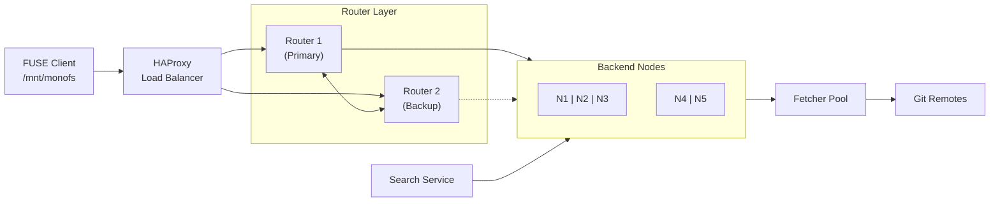

<p align="center">
  
</p>

# MonoFS

**A distributed filesystem that turns Git repositories and Go modules into a unified, mountable filesystem.**

Mount hundreds of Git repositories and Go modules as a single filesystem. Browse with `ls`, search with `grep`, edit with your favorite editor. MonoFS handles the distribution, caching, and failover automatically.

[](LICENSE)
[](https://go.dev)
[](docker-compose.yml)

---

## The Problem

You have dozens (or hundreds) of Git repositories and Go modules. To work with them, you:

1. Clone repos or download modules locally
2. Navigate to the right directory
3. Make changes
4. Commit and push (or re-vendor)

This doesn't scale. Disk space fills up. Repos get out of sync. Finding the right file means remembering which repo or module it's in.

## The Solution

MonoFS mounts all your repositories and Go modules as a single filesystem:

```
/mnt/monofs/
├── github.com/
│   ├── kubernetes/kubernetes/          # Git repository
│   │   ├── README.md
│   │   ├── pkg/
│   │   └── cmd/
│   └── gin-gonic/gin@v1.9.0/           # Go module
│       ├── gin.go
│       └── context.go
├── golang.org/
│   └── x/tools@v0.15.0/                # Go module
└── gitlab.com/
    └── your-company/
        └── services/                    # Git repository
```

Navigate with `cd`. Read files instantly. Edit and commit changes back. Search across everything.

---

## Key Features

| Feature | Description |
|---------|-------------|
| **Unified View** | All repositories appear as one filesystem |
| **Distributed Storage** | Files spread across backend nodes for scalability |
| **Automatic Failover** | Node failures handled transparently |
| **Full-Text Search** | Search code across all repositories instantly |
| **Write Support** | Edit files and commit changes back |
| **Web Dashboard** | Monitor cluster health and manage repositories |
| **Go Module Support** | Mount Go modules alongside Git repos |
| **Streaming I/O** | Large files streamed in chunks - no size limit |

---

## Quick Start

### Prerequisites

- Docker and Docker Compose
- FUSE support (`apt install fuse` on Ubuntu/Debian)
- Go 1.21+ (for building binaries)

### 1. Start the Cluster

```
git clone https://github.com/radryc/monofs.git
cd monofs
docker-compose up -d
```

### 2. Build the Client

```
make build-client
```

### 3. Add a Repository

```
docker exec -it monofs-router1-1 /app/monofs-admin ingest \
  --router=localhost:9090 \
  --source=https://github.com/golang/example.git \
  --ref=master
```

### 4. Mount the Filesystem

```
mkdir -p /tmp/monofs
./bin/monofs-client --mount=/tmp/monofs --router=localhost:9090
```

### 5. Browse Your Files

```
ls /tmp/monofs/github.com/golang/example/
cat /tmp/monofs/github.com/golang/example/README.md
```

---

## Architecture Overview



**How it works:**

1. **Client** mounts filesystem and makes requests for files
2. **Router** determines which node stores each file using consistent hashing
3. **Nodes** store file metadata and serve lookups
4. **Fetchers** retrieve actual file content from Git remotes
5. **Search** indexes repositories for fast code search

---

## Components

| Binary | Purpose |
|--------|---------|
| `monofs-client` | FUSE client - mounts the filesystem |
| `monofs-router` | Cluster coordinator - manages nodes and sharding |
| `monofs-server` | Backend node - stores file metadata |
| `monofs-fetcher` | Blob fetcher - retrieves files from Git/GoMod |
| `monofs-search` | Search service - Zoekt-powered code search |
| `monofs-admin` | Admin CLI - cluster management |
| `monofs-session` | Session CLI - write session management |

---

## Administration

### Cluster Status

```
./bin/monofs-admin status --router=localhost:9090
```

### List Repositories

```
./bin/monofs-admin repos --router=localhost:8080
```

### Ingest a Repository

```
./bin/monofs-admin ingest \
  --router=localhost:9090 \
  --source=https://github.com/owner/repo.git \
  --ref=main
```

### Delete a Repository

```
./bin/monofs-admin delete --router=localhost:9090 --storage-id=<id>
```

### View Cluster Statistics

```
./bin/monofs-admin stats --type=all
```

### Maintenance Mode

```
# Before maintenance (prevents failover triggers)
./bin/monofs-admin drain --router=localhost:9090 --reason="Upgrade"

# After maintenance
./bin/monofs-admin undrain --router=localhost:9090
```

---

## Write Support

MonoFS supports editing files through write sessions:

### Enable Write Mode

```
./bin/monofs-client \
  --mount=/tmp/monofs \
  --router=localhost:9090 \
  --writable
```

### Manage Changes

```
# Check session status
./bin/monofs-session status

# Make edits to files in the mounted filesystem...

# Commit changes to backend
./bin/monofs-session commit

# Or discard changes
./bin/monofs-session discard
```

---

## Web Dashboard

Access the Web UI at **http://localhost:8080** when the cluster is running.

**Available pages:**
- **Dashboard** (`/`) - Cluster overview and health
- **Cluster** (`/cluster`) - Node status and failover state
- **Clients** (`/clients`) - Connected FUSE clients
- **Performance** (`/performance`) - Performance metrics and statistics
- **Replication** (`/replication`) - Replication status and failover mappings
- **Repositories** (`/repositories`) - Ingested repositories
- **Ingest** (`/ingest`) - Add new repositories
- **Search** (`/search`) - Full-text code search
- **Indexer** (`/indexer`) - Search indexer status and jobs
- **Fetchers** (`/fetchers`) - Fetcher pool status and statistics

---

## Search

Search code across all indexed repositories:

### Web UI

Go to http://localhost:8080/search

### CLI

```
./bin/monofs-session search --query "func main" --max-results 20
```

### Features

- Literal and regex search
- File pattern filtering
- Case-sensitive option
- Symbol search
- Context lines

---

## Configuration

### Environment Variables

| Variable | Default | Description |
|----------|---------|-------------|
| `MONOFS_ROUTER` | localhost:9090 | Router address |
| `MONOFS_OVERLAY_DIR` | ~/.monofs/overlay | Write session storage |

### Common Flags

**Client:**
- `--mount` - Mount point (required)
- `--router` - Router address
- `--cache` - Local cache directory
- `--writable` - Enable write support

**Router:**
- `--port` - gRPC port (default: 9090)
- `--http-port` - Web UI port (default: 8080)
- `--nodes` - Backend node addresses
- `--replication-factor` - Data redundancy level

**Admin:**
- `--router` - Router address for gRPC commands
- `--format` - Output format (table/json)

---

## Technical Limits

| Limit | Value | Notes |
|-------|-------|-------|
| Max file size | **Unlimited** | Files streamed in chunks |
| Chunk size | ~1MB | Per gRPC message |
| Search index limit | 1MB | Files >1MB truncated for indexing |
| Default cache | 50GB | Configurable via `--max-cache-gb` |

---

## Development

### Build All Binaries

```
make build
```

### Run Tests

```
make test
```

### Run Specific Tests

```
make test-unit
make test-e2e
```

### Local Development Cluster

```
# Start without Docker
./bin/monofs-server --addr=:9001 --node-id=node1 &
./bin/monofs-router --port=9090 --nodes=node1=localhost:9001 &
./bin/monofs-fetcher --port=9200 &
```

---

## Documentation

| Document | Description |
|----------|-------------|
| [Quick Start](docs/QUICKSTART.md) | Get running in 5 minutes |
| [Architecture](docs/ARCHITECTURE.md) | System design and data flows |
| [Deployment](docs/DEPLOYMENT.md) | Production deployment guide |

---

## Makefile Targets

| Target | Description |
|--------|-------------|
| `make build` | Build all binaries |
| `make test` | Run all tests |
| `make docker-up` | Start Docker cluster |
| `make docker-down` | Stop Docker cluster |
| `make mount` | Mount filesystem (read-only) |
| `make mount-writable` | Mount filesystem (with write support) |
| `make unmount` | Unmount filesystem |

---

## Requirements

| Component | Requirement |
|-----------|-------------|
| Go | 1.21+ |
| Docker | 20.10+ |
| FUSE | fuse or fuse3 |
| OS | Linux (macOS with macFUSE) |

---

## License

Apache 2.0 - See [LICENSE](LICENSE) for details.
