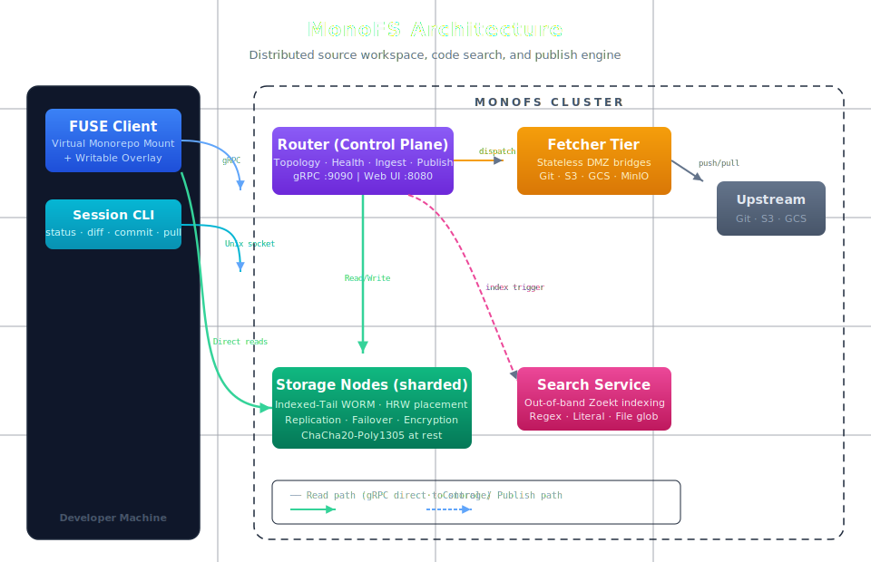

# MonoFS

<!-- markdownlint-disable MD033 -->
<p align="center">
  
</p>

<p align="center"><strong>Distributed source workspaces, code search, and publish workflows for one clustered system.</strong></p>

<p align="center">
  <a href="#quick-start">Quick Start</a> ·
  <a href="#developer-flow">Developer Flow</a> ·
  <a href="#projected-workspace-mount">Projected Workspace</a> ·
  <a href="docs/virtual-monorepo-workflow.md">Workflow Guide</a> ·
  <a href="cmd/monofs-session/README.md">Session CLI</a> ·
  <a href="#architecture">Architecture</a>
</p>
<!-- markdownlint-enable MD033 -->

> Part of the **Strata** platform.

MonoFS is a distributed source workspace platform for serving repositories, dependency data, code search, publish workflows, and managed operational namespaces through one clustered system.

The local FUSE mount is one client surface, not the whole product. MonoFS also includes a router control plane, sharded storage nodes, a writable overlay workflow, a fetcher tier for upstream Git and blob access, a search service, session tooling, and built-in namespaces such as `doctor` for observability data and `guardian` for partition and rollout control. The current release targets Linux and WSL-style environments where the FUSE client is available.

Module path: `github.com/radryc/monofs`

License: Apache-2.0. See [LICENSE](LICENSE).

## What This Release Includes

- A read path that serves repository content through a FUSE mount.
- HRW (rendezvous) sharding across backend nodes.
- Router-managed topology, failover, and cluster status.
- Kubernetes bootstrap and partition release flows through the sibling `../monotools` operational entrypoints.
- Writable overlay sessions with publish and refresh through `monofs-session`.
- Workspace publish through the router and fetcher sync path.
- Full-text code search through `monofs-search`.
- Built-in namespaces such as `doctor` for observability and `guardian` for deployment control, plus router UI surfaces.
- Kubernetes bootstrap through the sibling `../monotools` repo, plus minimal local multi-node development targets.

## Current Limits

- Publish goes through `monofs-session commit`, not `git commit` at the mount root.
- Dependency and blob-backed paths under `dependency/**` are not part of source publish. Use `monofs-session push` first.
- Branch creation is supported, but pull-request and merge automation are not.
- The native protocol and kernel module work are still experimental and are not part of the stable public release surface.

## Built-In Namespaces

MonoFS includes first-class namespaces that are not ordinary source repositories.

- `doctor` is the observability namespace. It is used for telemetry-oriented data and APIs such as trace, log, metric, topology, and health views.
- `guardian` is the deployment-control namespace. It is used for partition state, intents, reconcile inputs, rollout state, and other managed control-plane assets.
- `guardian-system` is the internal machinery namespace behind Guardian. It stores queue, archive, and other system-managed files rather than user-edited source content.

In raw namespace mounts these appear as part of the filesystem surface. In virtual-monorepo mode they are intentionally kept out of the projected source root so development workflows stay focused on repositories.

## Requirements

- A reachable Kubernetes cluster with `kubectl` pointed at the right context.
- Cluster-admin access for the bootstrap flow, which creates namespaces, RBAC, and cluster prerequisites.
- Docker with BuildKit for building and distributing images during bootstrap and release.
- `guardianctl` on `PATH`, or `GUARDIANCTL_BIN` set to a built `guardianctl` binary.
- Sibling checkouts of `kvs/` and `cfg/` next to `monofs/` for local builds, because `go.mod` uses local replaces for those repos.
- Sibling checkouts of `guardian/`, `doctor/`, and `monotools/` alongside `monofs/` if you are using the Kubernetes bootstrap flow described below.
- Linux or WSL with FUSE support if you want to mount the workspace locally.
- Go 1.25.7.
- `protoc` only if you need to regenerate protobufs.

## Build

Build every binary:

```bash
make build
```

Build a single binary:

```bash
make build-server
```

Generated binaries are written to `bin/`.

## Quick Start

### 1. Build

```bash
git clone https://github.com/radryc/monofs.git
git clone https://github.com/radryc/kvs.git
git clone https://github.com/radryc/cfg.git
cd monofs
make build
```

### 2. Bootstrap MonoFS on Kubernetes

From the sibling workspace layout, use the operational bootstrap entrypoint:

```bash
mt-bootstrap deploy
mt-bootstrap stamp-urls
```

This brings up the phase-1 MonoFS storage stack in `storage-k8s`, the phase-2 Guardian control plane in `guardian-configs`, installs `metrics-server`, and applies the bootstrap RBAC needed by the released partitions.

### 3. Release the Application Partitions

Release individual partitions:

```bash
mt-release --partition doctor
mt-release --partition dev-workspace
```

Or release the whole stack in dependency order:

```bash
mt-release --all
```

### 4. Ingest a Repository

```bash
./bin/monofs-admin ingest \
  --router=localhost:9090 \
  --source=https://github.com/golang/example.git \
  --ref=main
```

### 5. Connect a Local Client

If your cluster does not expose a directly reachable MonoFS endpoint, forward the storage service locally:

```bash
mt-bootstrap port-forward
```

Then mount a local client against the forwarded or externally reachable router endpoint.

Mount locally:

```bash
mkdir -p /tmp/monofs
./bin/monofs-client --mount=/tmp/monofs --router=localhost:9090
ls /tmp/monofs/github.com/golang/example/
```

If the router advertises host-facing node addresses, use:

```bash
./bin/monofs-client --mount=/tmp/monofs --router=localhost:9090 --use-external-addrs
```

## Developer Flow

MonoFS works best as a repeatable development loop: bootstrap the shared platform, release the working partitions, ingest repositories, mount a projected workspace, then publish and refresh explicitly through `monofs-session`.

<!-- markdownlint-disable MD033 -->
<p align="center">
  
</p>
<!-- markdownlint-enable MD033 -->

## Projected Workspace Mount

For day-to-day development, the common client shape is a writable projected workspace using `--virtual-monorepo` plus an overlay outside the mount.

Typical development mount:

```bash
./bin/monofs-client \
  --mount=/tmp/monofs \
  --router=localhost:9090 \
  --use-external-addrs \
  --virtual-monorepo \
  --writable \
  --overlay=/tmp/monofs-overlay
```

This mode gives you a projected source root, hides raw system namespaces from the development view, and keeps a synthetic root Git worktree available for `git status` and `git diff`.

If you want the raw namespace tree instead of the projected development view, omit `--virtual-monorepo`.

Keep the overlay, cache, and workspace Git state outside the mountpoint. Mounting with `--overlay` under the mounted tree will recurse through FUSE state and hang basic filesystem operations.

Common session commands:

```bash
./bin/monofs-session status
./bin/monofs-session diff
./bin/monofs-session commit -m "Refactor router sync"
./bin/monofs-session pull
./bin/monofs-session push
./bin/monofs-session discard
```

`direct`, `workspace_branch`, and `per_repo_branch` publish strategies are supported. A successful `direct` publish also refreshes the workspace state so the synthetic root Git view becomes clean again.

For the full writable flow, see [docs/virtual-monorepo-workflow.md](docs/virtual-monorepo-workflow.md).

## Development Example

One practical way to use MonoFS for daily development is to use it on MonoFS itself and the sibling platform repositories, then publish changes back through `monofs-session`.

Example flow:

```bash
# Bootstrap storage and control plane first.
mt-bootstrap deploy
mt-bootstrap stamp-urls
mt-release --partition doctor
mt-release --partition dev-workspace

# Forward the storage service locally if needed.
mt-bootstrap port-forward

# Build the local client binaries and keep a handle to them.
make build
MONOFS_BIN="$PWD/bin"

# Ingest the MonoFS stack repositories you want in the workspace.
"$MONOFS_BIN/monofs-admin" ingest \
  --router=localhost:9090 \
  --source=https://github.com/radryc/monofs.git \
  --ref=main
"$MONOFS_BIN/monofs-admin" ingest \
  --router=localhost:9090 \
  --source=https://github.com/radryc/guardian.git \
  --ref=main
"$MONOFS_BIN/monofs-admin" ingest \
  --router=localhost:9090 \
  --source=https://github.com/radryc/doctor.git \
  --ref=main

# Mount a writable virtual monorepo with state outside the mount.
mkdir -p /tmp/monofs-dev /tmp/monofs-overlay
"$MONOFS_BIN/monofs-client" \
  --mount=/tmp/monofs-dev \
  --router=localhost:9090 \
  --use-external-addrs \
  --virtual-monorepo \
  --writable \
  --overlay=/tmp/monofs-overlay

# Work from the mounted root.
cd /tmp/monofs-dev
git status
rg "workspace sync|guardian" github.com/radryc

# Drop into MonoFS itself when you want to test a package.
cd github.com/radryc/monofs
go test ./internal/router/...
cd /tmp/monofs-dev

# Edit files with your editor, then inspect and publish changes.
"$MONOFS_BIN/monofs-session" status
"$MONOFS_BIN/monofs-session" diff
"$MONOFS_BIN/monofs-session" commit -m "Update MonoFS router sync flow"
```

What this gives you:

- one mounted workspace for multiple repositories
- root-level `git status` and `git diff` for the projected source tree
- normal editor and shell workflows against the mounted files
- explicit publish and refresh steps through `monofs-session`

If upstream changes land while you are mounted, run `./bin/monofs-session pull` to refresh the workspace baseline before continuing.

## Components

| Binary | Role |
| --- | --- |
| `monofs-client` | FUSE mount client and writable overlay entry point |
| `monofs-router` | Cluster control plane, `doctor` observability and `guardian` deployment-control namespaces, workspace sync orchestration, and web UI |
| `monofs-server` | Backend storage node for metadata and file serving |
| `monofs-fetcher` | External blob and Git access tier |
| `monofs-search` | Code indexing and search service |
| `monofs-admin` | Administrative CLI for ingest, status, deletion, and maintenance |
| `monofs-session` | Writable-session CLI for diff, commit, pull, push, discard, and search |
| `monofs-loadtest` | Load generation and stress tooling |
| `monofs-trace-dump` | Trace inspection utility |

## Architecture

MonoFS is organized around a router-led control plane rather than a single filesystem daemon.

<!-- markdownlint-disable MD033 -->
<p align="center">
  
</p>
<!-- markdownlint-enable MD033 -->

- The router is the coordination layer. It tracks healthy nodes, serves cluster topology to clients, drives workspace publish and refresh jobs, exposes the built-in `doctor` observability namespace and `guardian` deployment-control namespace, and backs the main UI.
- Backend storage nodes hold sharded repository metadata and serve file operations for mounted clients.
- The fetcher tier is the bridge to upstream systems. It handles external Git and blob access, stages workspace bundles, and executes publish and refresh work.
- The search service builds and serves indexes separately from the read path so search does not sit in the critical file-serving loop.
- The FUSE client is one consumer of this system. It mounts the workspace locally, talks to the router for topology and orchestration, and reads from the backend node set.

In practice there are two main runtime flows:

- Read path: the client mounts a projected workspace, resolves cluster state through the router, and reads directory and file data from the backend nodes.
- Publish or refresh path: `monofs-session` sends workspace state through the router, the router coordinates a fetcher job, and the resulting upstream changes are reflected back into the mounted workspace.

## Common Targets

| Command | Purpose |
| --- | --- |
| `mt-bootstrap deploy` | Bootstrap MonoFS storage and Guardian control plane on Kubernetes |
| `mt-bootstrap stamp-urls` | Stamp resolved external Guardian and Doctor URLs into the partition templates |
| `mt-release --all` | Release all application partitions in dependency order |
| `make build` | Build all binaries into `bin/` |
| `make run-cluster` | Run a minimal local MonoFS-only cluster without the Kubernetes stack |
| `make test-unit` | Run unit tests |
| `make test-race` | Run tests with the race detector |
| `make test-deadlock` | Run deadlock-focused tests |
| `make test-coverage` | Run tests and generate coverage output |

## Repository Layout

| Path | Purpose |
| --- | --- |
| `cmd/` | Binary entry points |
| `internal/client/` | Cluster client and workspace publish logic |
| `internal/fuse/` | FUSE filesystem and writable overlay implementation |
| `internal/router/` | Cluster router, UI, `doctor` observability and `guardian` deployment-control namespaces, and workspace sync control plane |
| `internal/server/` | Backend node implementation |
| `internal/search/` | Search service implementation |
| `internal/storage/` | Ingestion and fetch backends |
| `api/proto/` | Protobuf service definitions and generated stubs |
| `docs/` | Release-relevant user and operator workflow notes |
| `test/` | Integration and stress coverage |

## Docs

- [docs/virtual-monorepo-workflow.md](docs/virtual-monorepo-workflow.md)
- [cmd/monofs-session/README.md](cmd/monofs-session/README.md)

## Notes For Operators

- Version information is injected at build time through linker flags.
- The Kubernetes bootstrap flow creates the MonoFS storage stack in `storage-k8s` and the bootstrap Guardian control plane in `guardian-configs`.
- `mt-bootstrap deploy` is the operational entrypoint for bringing up the shared stack; `mt-release` handles per-partition rollout after bootstrap.
- The search, `doctor`, `guardian`, and workspace-sync features are in the same repository and share the router control plane.
