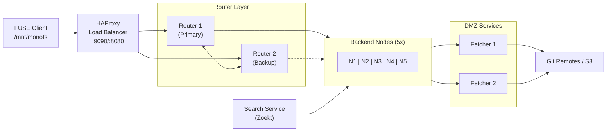

<p align="center">
  
</p>

# MonoFS

**A distributed FUSE filesystem that mounts Git repositories and Go modules as a unified, mountable filesystem.**

Mount hundreds of Git repositories and Go modules as a single filesystem. Browse with `ls`, search with `grep`, edit with your favorite editor. MonoFS handles the distribution, caching, and failover automatically.

[](LICENSE)
[](https://go.dev)
[](docker-compose.yml)

---

## The Problem

You have dozens (or hundreds) of Git repositories and Go modules. To work with them, you:

1. Clone repos or download modules locally
2. Navigate to the right directory
3. Make changes
4. Commit and push (or re-vendor)

This doesn't scale. Disk space fills up. Repos get out of sync. Finding the right file means remembering which repo or module it's in.

## The Solution

MonoFS mounts all your repositories and Go modules as a single filesystem:

```
/mnt/monofs/
├── github.com/
│   ├── kubernetes/kubernetes/          # Git repository
│   │   ├── README.md
│   │   ├── pkg/
│   │   └── cmd/
│   └── gin-gonic/gin@v1.9.0/           # Go module
│       ├── gin.go
│       └── context.go
├── golang.org/
│   └── x/tools@v0.15.0/                # Go module
└── gitlab.com/
    └── your-company/
        └── services/                    # Git repository
```

Navigate with `cd`. Read files instantly. Edit and commit changes back. Search across everything.

---

## Key Features

| Feature | Description |
|---------|-------------|
| **Unified View** | All repositories appear as one filesystem |
| **Distributed Storage** | Files spread across backend nodes for scalability |
| **Automatic Failover** | Node failures handled transparently |
| **Full-Text Search** | Search code across all repositories instantly |
| **Write Support** | Edit files and commit changes back |
| **Web Dashboard** | Monitor cluster health and manage repositories |
| **Go Module Support** | Mount Go modules alongside Git repos |
| **Streaming I/O** | Large files streamed in chunks - no size limit |
| **HRW Sharding** | Consistent hashing for optimal data distribution |

---

## Quick Start

### Prerequisites

- Docker and Docker Compose
- FUSE support (`apt install fuse` on Ubuntu/Debian)
- Go 1.24+ (for building binaries)

### 1. Clone and Build

```bash
git clone https://github.com/radryc/monofs.git
cd monofs
make build
```

### 2. Start the Cluster

```bash
make deploy
```

This starts:
- HAProxy load balancer (ports 9090/8080)
- 2 Routers (primary/backup with peer coordination)
- 5 Backend storage nodes
- 2 Fetcher services (DMZ with external access)
- Search service (Zoekt-based indexing)
- 3 FUSE client containers with SSH access

### 3. Add a Repository

```bash
./bin/monofs-admin ingest \
  --router=localhost:9090 \
  --source=https://github.com/golang/example.git \
  --ref=master
```

### 4. Access the Filesystem

**Option A: SSH into client container**
```bash
ssh monofs@localhost -p 2222  # password: monofs
ls /mnt/monofs/github.com/golang/example/
```

**Option B: Mount locally**
```bash
mkdir -p /tmp/monofs
./bin/monofs-client --mount=/tmp/monofs --router=localhost:9090
ls /tmp/monofs/github.com/golang/example/
```

---

## Architecture Overview


```mermaid
flowchart LR
    Client["FUSE Client<br/>/mnt/monofs"]
    HAProxy["HAProxy<br/>Load Balancer<br/>:9090/:8080"]
    
    subgraph Routers["Router Layer"]
        R1["Router 1<br/>(Primary)"]
        R2["Router 2<br/>(Backup)"]
    end
    
    subgraph Nodes["Backend Nodes (5x)"]
        direction TB
        row1["N1 | N2 | N3 | N4 | N5"]
    end
    
    subgraph DMZ["DMZ Services"]
        F1["Fetcher 1"]
        F2["Fetcher 2"]
    end
    
    Search["Search Service<br/>(Zoekt)"]
    Git["Git Remotes / S3"]
    
    Client --> HAProxy
    HAProxy --> R1
    HAProxy --> R2
    R1 <--> R2
    R1 --> Nodes
    R2 -.-> Nodes
    Nodes --> F1
    Nodes --> F2
    F1 --> Git
    F2 --> Git
    Search --> Nodes
```

**How it works:**

1. **Client** mounts filesystem and makes requests for files
2. **HAProxy** load balances between redundant routers
3. **Router** determines which node stores each file using HRW (Highest Random Weight) consistent hashing
4. **Nodes** store file metadata in NutsDB and serve lookups
5. **Fetchers** retrieve actual file content from Git remotes or S3 (DMZ-isolated)
6. **Search** indexes repositories for fast code search

---

## Components

| Binary | Purpose | Protocol |
|--------|---------|----------|
| `monofs-client` | FUSE client - mounts the filesystem | FUSE + gRPC |
| `monofs-router` | Cluster coordinator - manages nodes and sharding | gRPC + HTTP |
| `monofs-server` | Backend node - stores file metadata | gRPC |
| `monofs-fetcher` | Blob fetcher - retrieves files from external sources | gRPC |
| `monofs-search` | Search service - Zoekt-powered code search | gRPC |
| `monofs-admin` | Admin CLI - cluster management | gRPC/HTTP |
| `monofs-session` | Session CLI - write session management | Unix socket |
| `monofs-loadtest` | Load testing tool - filesystem stress testing | FUSE |

---

## gRPC Services

MonoFS exposes three main gRPC services defined in `api/proto/`:

| Service | RPCs | Description |
|---------|------|-------------|
| `MonoFSRouter` | 19 | Cluster topology, node management, ingestion |
| `MonoFS` | 22 | File operations, metadata, blob retrieval |
| `MonoFSSearcher` | 6 | Code search and indexing |

---

## Administration

### Cluster Status

```bash
./bin/monofs-admin status --router=localhost:9090
```

### List Repositories

```bash
./bin/monofs-admin repos --router=localhost:8080
```

### Ingest a Repository

```bash
./bin/monofs-admin ingest \
  --router=localhost:9090 \
  --source=https://github.com/owner/repo.git \
  --ref=main
```

### Delete a Repository

```bash
./bin/monofs-admin delete --router=localhost:9090 --storage-id=<id>
```

### View Cluster Statistics

```bash
./bin/monofs-admin stats --type=all
```

### Maintenance Mode

```bash
# Before maintenance (prevents failover triggers)
./bin/monofs-admin drain --router=localhost:9090 --reason="Upgrade"

# After maintenance
./bin/monofs-admin undrain --router=localhost:9090
```

### Failover Management

```bash
# View failover status
./bin/monofs-admin failover --router=localhost:9090

# Trigger manual failover for a node
./bin/monofs-admin trigger-failover --router=localhost:9090 --node-id=node1

# Clear failover state
./bin/monofs-admin clear-failover --router=localhost:9090 --node-id=node1
```

### Fetcher Status

```bash
./bin/monofs-admin fetchers --router=localhost:8080 --detailed
```

---

## Write Support

MonoFS supports editing files through write sessions using an overlay filesystem:

### Enable Write Mode

```bash
./bin/monofs-client \
  --mount=/tmp/monofs \
  --router=localhost:9090 \
  --writable \
  --overlay=/path/to/overlay
```

Or use the Makefile:
```bash
make mount-writable MOUNT_POINT=/tmp/monofs
```

### Manage Changes

```bash
# Check session status
./bin/monofs-session status

# Show diff of changes
./bin/monofs-session diff

# Commit changes to backend
./bin/monofs-session commit

# Discard changes
./bin/monofs-session discard
```

**Note:** Write support requires both `--writable` and `--overlay` flags. The overlay directory stores pending changes before commit.

---

## Web Dashboard

Access the Web UI at **http://localhost:8080** when the cluster is running.

**Available pages:**
- **Dashboard** (`/`) - Cluster overview and health
- **Cluster** (`/cluster`) - Node status and failover state
- **Clients** (`/clients`) - Connected FUSE clients
- **Performance** (`/performance`) - Performance metrics and statistics
- **Replication** (`/replication`) - Replication status and failover mappings
- **Repositories** (`/repositories`) - Ingested repositories
- **Ingest** (`/ingest`) - Add new repositories
- **Search** (`/search`) - Full-text code search
- **Indexer** (`/indexer`) - Search indexer status and jobs
- **Fetchers** (`/fetchers`) - Fetcher pool status and statistics

**HAProxy Stats:** http://localhost:8404/stats

---

## Search

Search code across all indexed repositories:

### Web UI

Go to http://localhost:8080/search

### CLI (via session)

```bash
./bin/monofs-session search --query "func main" --max-results 20
./bin/monofs-session search --query "TODO" --regex --file-pattern="*.go"
```

### Features

- Literal and regex search
- File pattern filtering (glob syntax)
- Case-sensitive option
- Symbol search
- Repository-scoped search
- Context lines

---

## Configuration

### Environment Variables

| Variable | Default | Description |
|----------|---------|-------------|
| `MONOFS_ROUTER` | localhost:9090 | Router gRPC address |
| `MONOFS_ENCRYPTION_KEY` | - | Encryption key for sensitive data |

### Common Flags

**Client:**
- `--mount` - Mount point (required)
- `--router` - Router address
- `--cache` - Local cache directory
- `--writable` - Enable write support
- `--overlay` - Overlay directory for writes (required with --writable)

**Router:**
- `--port` - gRPC port (default: 9090)
- `--http-port` - Web UI port (default: 8080)
- `--nodes` - Backend node addresses (format: id=host:port,...)
- `--peer-routers` - Peer router addresses for coordination
- `--search-addr` - Search service address
- `--fetcher-addrs` - Fetcher service addresses

**Server:**
- `--node-id` - Unique node identifier (required)
- `--addr` - gRPC listen address
- `--db-path` - NutsDB database path
- `--git-cache` - Git repository cache path
- `--fetcher` - Fetcher service address (can specify multiple)

**Admin:**
- `--router` - Router address for gRPC commands
- `--format` - Output format (table/json)

---

## Technical Limits

| Limit | Value | Notes |
|-------|-------|-------|
| Max file size | **Unlimited** | Files streamed in chunks |
| Chunk size | ~1MB | Per gRPC message |
| Search index limit | 1MB | Files >1MB truncated for indexing |
| Default node cache | 20GB | Configurable via `--max-cache-gb` |
| Backend nodes | Unlimited | Tested with 5+ nodes |
| Routers | 2+ | HAProxy load balances between routers |

---

## Development

### Build All Binaries

```bash
make build
```

### Run Tests

```bash
# Unit tests only
make test-unit

# All tests including integration
make test

# Race detector
make test-race

# Deadlock detection (5min timeout)
make test-deadlock

# Stress tests (requires FUSE)
make test-stress

# E2E tests with sudo (builds as user, runs as root)
make test-e2e-sudo

# Coverage report
make test-coverage
```

### Local Development Cluster

```bash
# Start without Docker (3 nodes + router)
make run-cluster

# Or full Docker deployment
make deploy

# View logs
make docker-logs
```

### Regenerate Protobuf

```bash
make proto
```

Requires `protoc`, `protoc-gen-go`, and `protoc-gen-go-grpc`.

---

## Makefile Targets

| Target | Description |
|--------|-------------|
| `make build` | Build all binaries |
| `make build-server` | Build server binary only |
| `make build-client` | Build client binary only |
| `make build-router` | Build router binary only |
| `make test` | Run unit tests |
| `make test-unit` | Run unit tests only |
| `make test-race` | Run tests with race detector |
| `make test-deadlock` | Run deadlock detection tests |
| `make test-stress` | Run stress tests (requires FUSE) |
| `make test-e2e-sudo` | Run E2E tests with sudo |
| `make test-coverage` | Generate coverage report |
| `make deploy` | Deploy full Docker cluster |
| `make deploy-stop` | Stop Docker cluster |
| `make deploy-clean` | Stop and remove all data |
| `make deploy-local` | Start local dev cluster (no Docker) |
| `make run-cluster` | Quick local 3-node cluster |
| `make mount` | Mount FUSE client (requires MOUNT_POINT) |
| `make mount-writable` | Mount with write support |
| `make unmount` | Unmount FUSE client |
| `make proto` | Regenerate protobuf files |
| `make clean` | Remove build artifacts |
| `make help` | Show all targets |

---

## Project Structure

```
monofs/
├── api/proto/          # gRPC protobuf definitions
├── bin/                # Built binaries
├── cmd/                # Binary entry points
│   ├── monofs-admin/   # Admin CLI
│   ├── monofs-client/  # FUSE client
│   ├── monofs-fetcher/ # Blob fetcher service
│   ├── monofs-loadtest/# Load testing tool
│   ├── monofs-router/  # Cluster router
│   ├── monofs-search/  # Code search service
│   ├── monofs-server/  # Backend storage node
│   └── monofs-session/ # Write session CLI
├── internal/
│   ├── cache/          # Caching layer
│   ├── client/         # Client library + ShardedClient
│   ├── fetcher/        # Fetcher service implementation
│   ├── fuse/           # FUSE filesystem layer (op_*.go)
│   ├── git/            # Git operations
│   ├── grpcutil/       # gRPC utilities
│   ├── router/         # Router + Web UI
│   ├── search/         # Zoekt search integration
│   ├── server/         # Backend storage node
│   ├── sharding/       # HRW consistent hashing
│   └── storage/        # Storage interfaces
├── scripts/            # Test runners
├── test/               # Integration and E2E tests
├── docker-compose.yml  # Full cluster deployment
├── haproxy.cfg         # Load balancer config
├── Makefile            # Build automation
└── go.mod              # Go 1.24+
```

---

## Key Dependencies

| Package | Purpose |
|---------|---------|
| `go-git/v5` + `go-git/v6` | Git operations (both versions used) |
| `nutsdb` | Embedded KV store for metadata |
| `go-fuse/v2` | FUSE filesystem implementation |
| `zoekt` | Code search indexing |
| `radryc/packager` | Package/archive management |
| `grpc` | Inter-service communication |

---

## Requirements

| Component | Requirement |
|-----------|-------------|
| Go | 1.24+ |
| Docker | 20.10+ |
| Docker Compose | 2.0+ |
| FUSE | fuse or fuse3 |
| OS | Linux (client requires FUSE) |

---

## Troubleshooting

### Filesystem shows FS_ERROR.txt

This special file appears in the FUSE root when a backend failure occurs. Check:
- Router connectivity: `./bin/monofs-admin status --router=localhost:9090`
- Backend node logs: `make docker-logs`
- HAProxy stats: http://localhost:8404/stats

### Permission denied on dependency paths

The `dependency/` tree uses special permissions (0444/0555) for `go mod verify` compatibility. Do not change these permissions.

### Client fails to mount

- Ensure FUSE is installed: `apt install fuse3`
- Check if mount point is already mounted: `mount | grep monofs`
- Unmount if needed: `make unmount MOUNT_POINT=/path`

### Write operations fail

Write support requires BOTH flags:
```bash
--writable --overlay=/path/to/overlay
```

The overlay directory must be writable and persist across client restarts.

---

## License

Apache 2.0 - See [LICENSE](LICENSE) for details.
