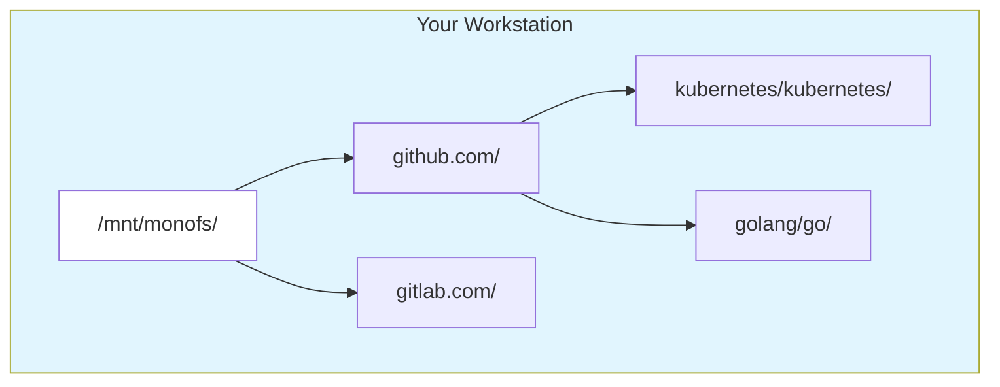
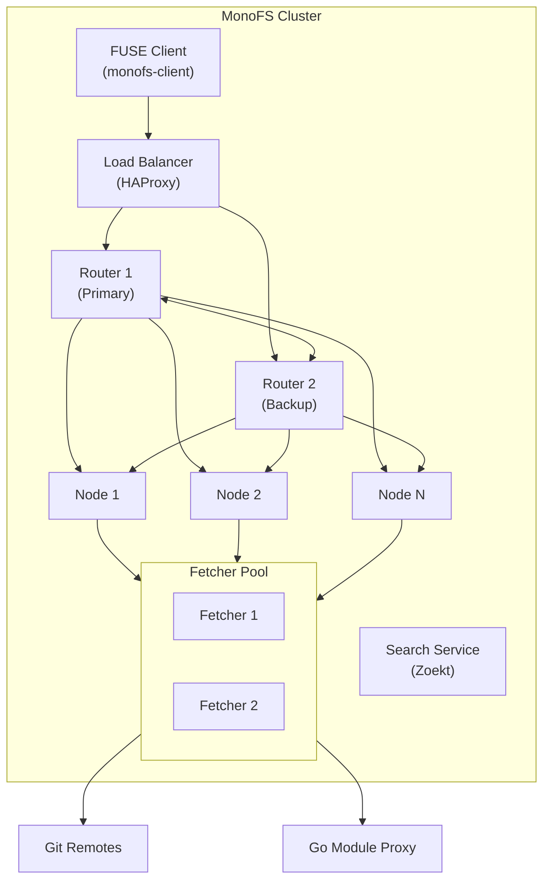
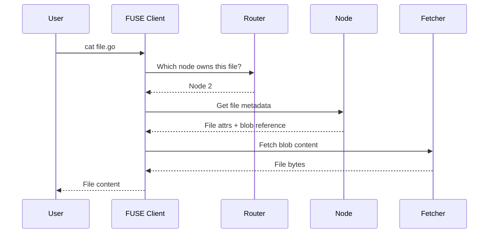
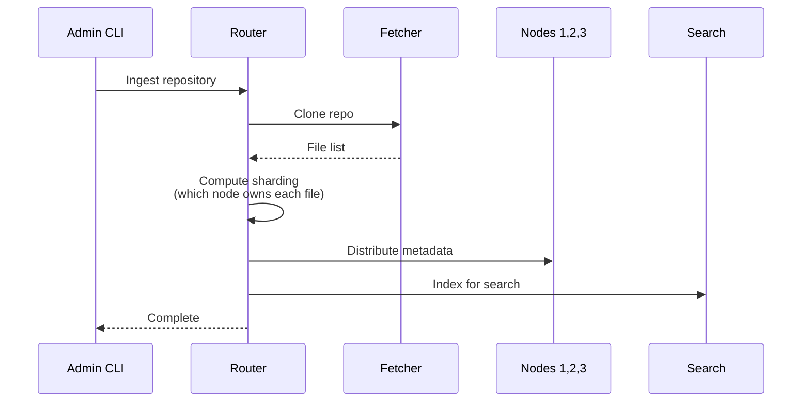
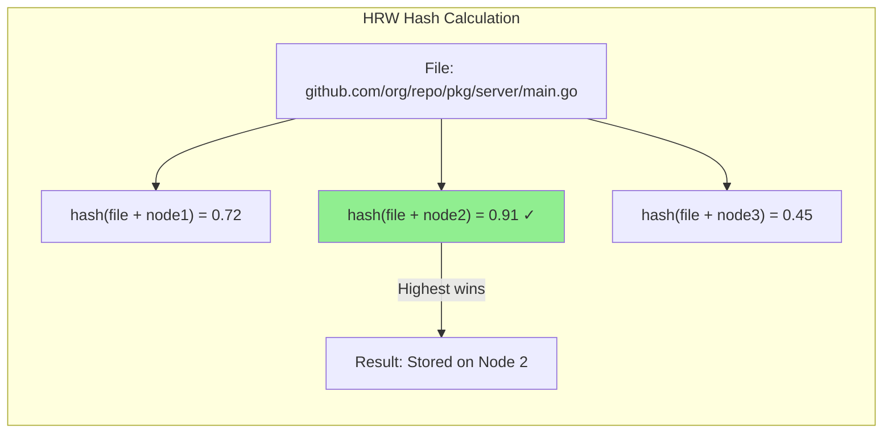
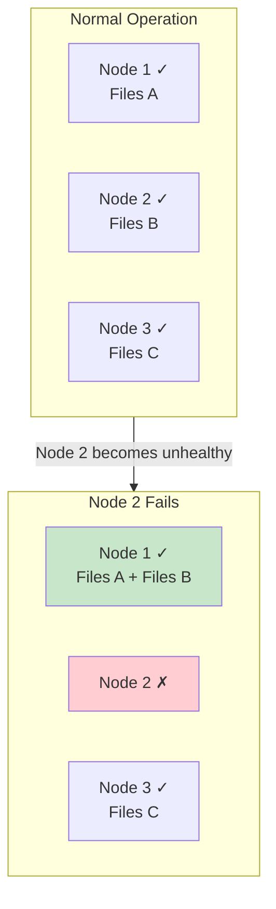
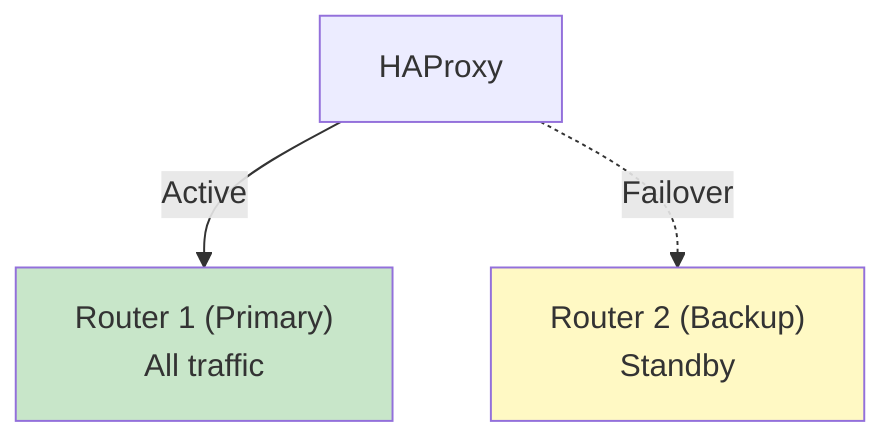
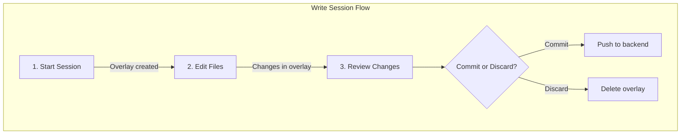
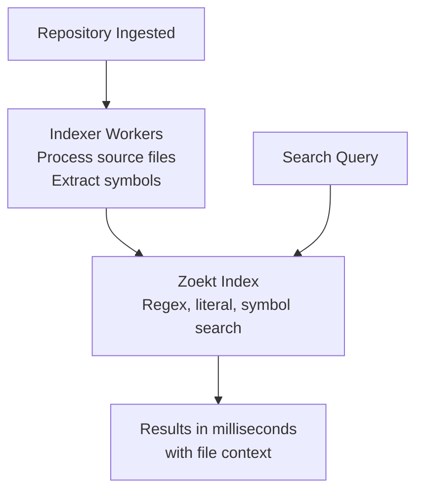
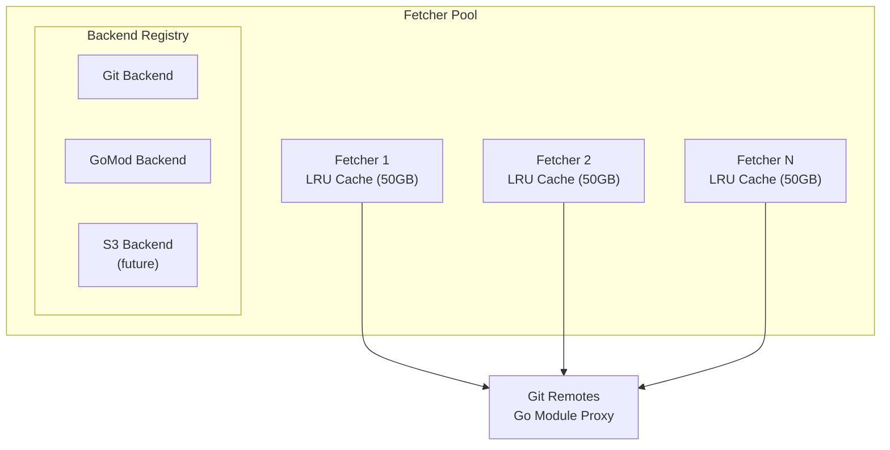

# MonoFS Architecture

MonoFS is a distributed filesystem that transforms Git repositories into a unified, mountable filesystem. This document explains how the system works and how its components interact.

---

## System Overview

MonoFS allows you to mount Git repositories as a local filesystem. Instead of cloning repositories to your workstation, you browse them directly through a FUSE mount. The system distributes file metadata across a cluster of backend nodes for scalability and fault tolerance.

---

## Core Components

### Component Diagram

### Component Responsibilities

| Component | Purpose |
|-----------|---------|
| **FUSE Client** | Mounts the filesystem, handles read/write operations, caches metadata locally |
| **Router** | Coordinates the cluster, determines which node owns which files, monitors health |
| **Backend Node** | Stores file metadata in NutsDB, serves file lookups, replicates data for failover |
| **Fetcher** | Retrieves actual file content from Git remotes or Go module proxies |
| **Search Service** | Indexes repositories for full-text code search using Zoekt |
| **HAProxy** | Load balances requests, handles router failover |

---

## Data Flow

### Reading a File

When you read a file from the mounted filesystem:

### Ingesting a Repository

When you add a new repository to the cluster:

---

## Sharding Strategy

MonoFS uses **Highest Random Weight (HRW) hashing** to distribute files across nodes. This ensures:

- **Deterministic placement**: Any component can compute which node owns a file
- **Minimal reshuffling**: Adding/removing nodes only moves files to/from that node
- **Load balancing**: Files are evenly distributed based on their paths

---

## Failover & High Availability

### Node Failure Recovery

When a backend node fails, the system automatically redirects traffic to backup nodes:

**Failover behavior:**

| Scenario | Behavior |
|----------|----------|
| Node becomes unhealthy | Traffic redirected to backup node within seconds |
| Node returns healthy | Traffic gradually returns to primary node |
| Planned maintenance | Use `drain` command to prevent failover triggers |
| Multiple node failures | System remains available if any replica exists |

### Router Redundancy

Two routers operate in active-backup mode:

---

## Write Sessions

MonoFS supports editing files through **write sessions**. Changes are stored locally until you commit them:

---

## Search Architecture

The search service indexes all ingested repositories for fast code search:

---

## Fetcher Architecture

Fetchers are stateless services that retrieve file content from external sources:

**Features:**
- Horizontal scaling for throughput
- Local caching reduces external network calls
- Repo-affinity routing for cache efficiency

---

## Performance Characteristics

| Operation | Typical Latency | Notes |
|-----------|----------------|-------|
| File lookup (cached) | < 5ms | Metadata in local cache |
| File lookup (uncached) | 20-50ms | Network round-trip to node |
| File read (cached) | < 10ms | Content in fetcher cache |
| File read (uncached) | 100-500ms | Depends on file size and network |
| Directory listing | 10-30ms | Batched metadata fetch |
| Search query | 50-200ms | Depends on index size |
| Repository ingestion | 30s - 5min | Depends on repo size |

---

## Configuration Reference

### Router Configuration

| Parameter | Default | Description |
|-----------|---------|-------------|
| `replication-factor` | 2 | Number of copies for each file's metadata |
| `health-interval` | 2s | How often to check node health |
| `unhealthy-threshold` | 6s | Time before marking node unhealthy |
| `rebalance-delay` | 10m | Wait time before permanent rebalancing |
| `graceful-failover-delay` | 60s | Wait time for graceful failover |

### Node Configuration

| Parameter | Default | Description |
|-----------|---------|-------------|
| `db-path` | /tmp/monofs-db | NutsDB database location |
| `git-cache` | /tmp/monofs-git-cache | Local Git cache directory |
| `enable-prediction` | false | Enable access pattern prediction |

### Fetcher Configuration

| Parameter | Default | Description |
|-----------|---------|-------------|
| `cache-dir` | /data/fetcher-cache | Cache directory for repos/modules |
| `max-cache-gb` | 50 | Maximum cache size |
| `cache-age-hours` | 2 | Max age before eviction |
| `prefetch-workers` | 4 | Background prefetch workers |

### Client Configuration

| Parameter | Default | Description |
|-----------|---------|-------------|
| `cache` | (none) | Local metadata cache directory |
| `overlay` | ~/.monofs/overlay | Write session storage |
| `rpc-timeout` | 10s | Timeout for RPC calls |
| `writable` | false | Enable write support |

---

## Security Considerations

- **Network isolation**: Fetchers should be in a DMZ with external access; nodes should be internal-only
- **No authentication**: Current version does not include authentication (roadmap item)
- **TLS support**: Can be enabled for gRPC connections
- **File permissions**: FUSE mount respects Unix permissions based on Git file modes

---

## Limitations

- Maximum file size: **Unlimited** (files streamed in chunks via gRPC streaming)
- Search index limit: 1MB per file (larger files truncated for indexing)
- Maximum files per repository: No hard limit, but performance degrades above 1M files
- Concurrent writes: Single-writer model per session
- Real-time sync: Changes must be explicitly committed (not automatic sync)
