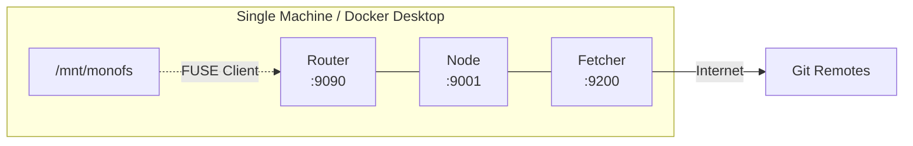
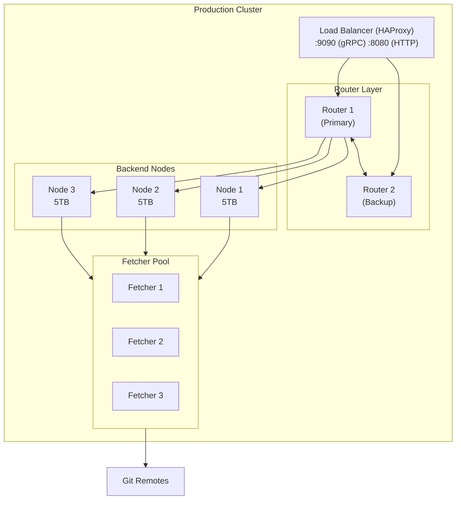
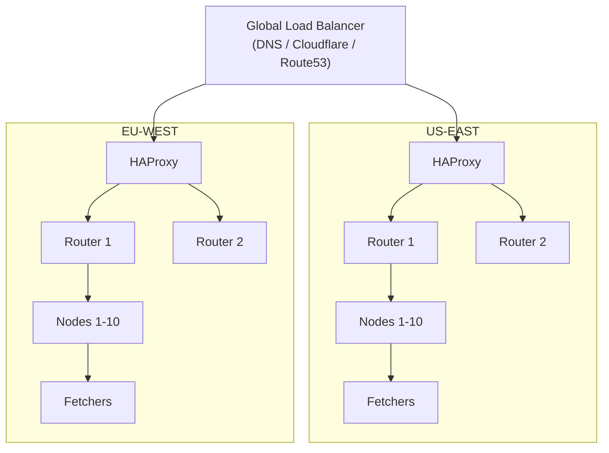
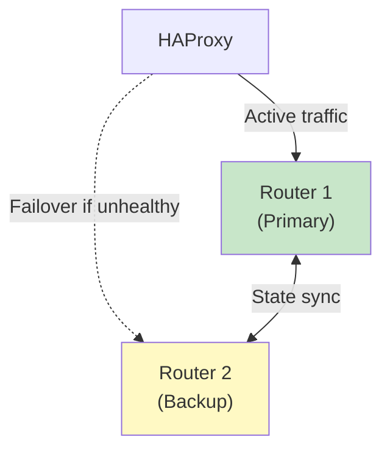
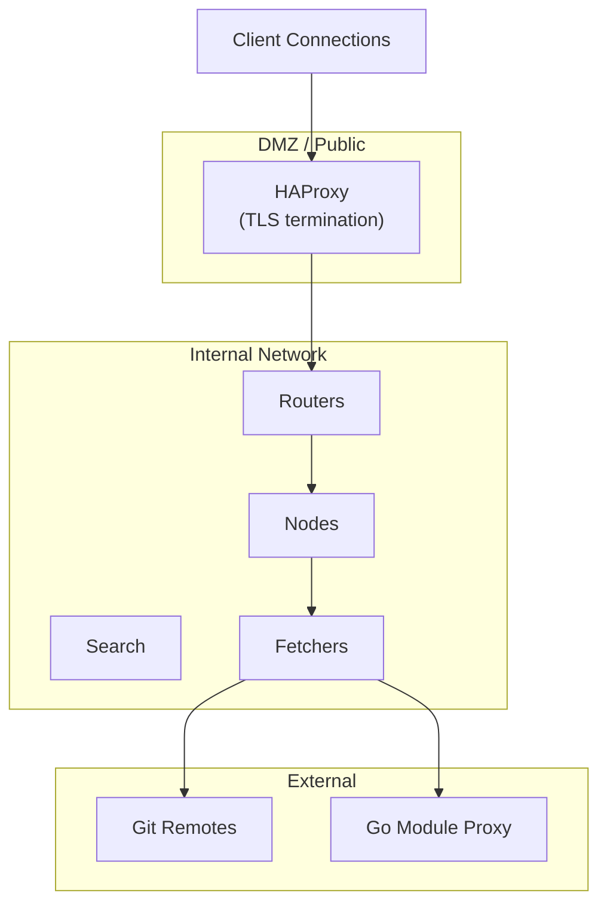
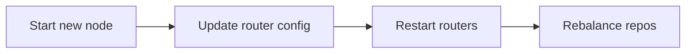
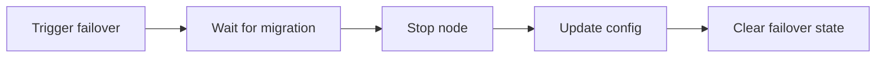
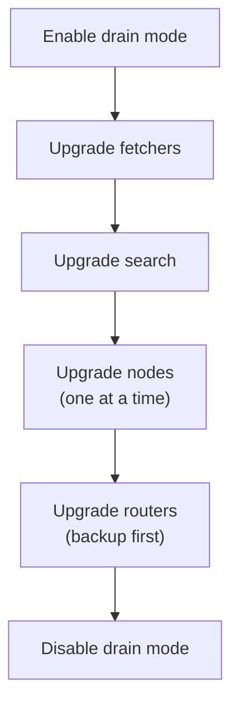

# MonoFS Deployment Guide

This guide covers deploying MonoFS in production environments, from single-server setups to multi-datacenter clusters.

---

## Deployment Topologies

### Development (Single Machine)



**Use case:** Local development, testing  
**HA:** None

### Small Production (Single Datacenter)



**Use case:** Production workloads up to 10TB  
**HA:** Router failover, node failover, fetcher redundancy

### Large Production (Multi-Datacenter)



**Use case:** Global deployments, latency-sensitive workloads  
**HA:** Multi-region redundancy, geo-routing

---

## Docker Compose Deployment

### Basic Setup

The included `docker-compose.yml` provides a complete cluster:

```
docker-compose up -d
```

This starts:
- 2 routers (primary + backup)
- 5 backend nodes
- 2 fetchers
- 1 search service
- 1 HAProxy load balancer

### Customizing the Deployment

Create `docker-compose.override.yml` for customizations:

```yaml
version: '3.8'

services:
  node1:
    volumes:
      - /data/monofs/node1:/data  # Persistent storage
    environment:
      - MONOFS_NODE_ID=node1
      
  router1:
    environment:
      - MONOFS_REPLICATION_FACTOR=3  # Increase redundancy
```

### Scaling Nodes

Add more backend nodes in your override file:

```yaml
services:
  node6:
    image: monofs:latest
    command: >
      /app/monofs-server
        --addr=:9000
        --node-id=node6
        --db-path=/data/db
    volumes:
      - node6-data:/data
    networks:
      - monofs

volumes:
  node6-data:
```

Update router configuration to include the new node:

```yaml
services:
  router1:
    command: >
      /app/monofs-router
        --nodes=node1=node1:9000,node2=node2:9000,...,node6=node6:9000
```

---

## Kubernetes Deployment

### Namespace and ConfigMap

```yaml
apiVersion: v1
kind: Namespace
metadata:
  name: monofs
---
apiVersion: v1
kind: ConfigMap
metadata:
  name: monofs-config
  namespace: monofs
data:
  REPLICATION_FACTOR: "2"
  HEALTH_INTERVAL: "2s"
  UNHEALTHY_THRESHOLD: "6s"
```

### Node StatefulSet

Deploy backend nodes as a StatefulSet for stable network identities:

```yaml
apiVersion: apps/v1
kind: StatefulSet
metadata:
  name: monofs-node
  namespace: monofs
spec:
  serviceName: monofs-node
  replicas: 5
  selector:
    matchLabels:
      app: monofs-node
  template:
    metadata:
      labels:
        app: monofs-node
    spec:
      containers:
      - name: node
        image: monofs:latest
        args:
        - /app/monofs-server
        - --addr=:9000
        - --node-id=$(POD_NAME)
        - --db-path=/data/db
        env:
        - name: POD_NAME
          valueFrom:
            fieldRef:
              fieldPath: metadata.name
        ports:
        - containerPort: 9000
        volumeMounts:
        - name: data
          mountPath: /data
        resources:
          requests:
            memory: "2Gi"
            cpu: "500m"
          limits:
            memory: "4Gi"
            cpu: "2"
  volumeClaimTemplates:
  - metadata:
      name: data
    spec:
      accessModes: ["ReadWriteOnce"]
      resources:
        requests:
          storage: 100Gi
```

### Router Deployment

```yaml
apiVersion: apps/v1
kind: Deployment
metadata:
  name: monofs-router
  namespace: monofs
spec:
  replicas: 2
  selector:
    matchLabels:
      app: monofs-router
  template:
    metadata:
      labels:
        app: monofs-router
    spec:
      containers:
      - name: router
        image: monofs:latest
        args:
        - /app/monofs-router
        - --port=9090
        - --http-port=8080
        - --nodes=monofs-node-0.monofs-node:9000,monofs-node-1.monofs-node:9000,...
        ports:
        - containerPort: 9090
          name: grpc
        - containerPort: 8080
          name: http
        resources:
          requests:
            memory: "512Mi"
            cpu: "250m"
```

### Services

```yaml
apiVersion: v1
kind: Service
metadata:
  name: monofs-router
  namespace: monofs
spec:
  type: LoadBalancer
  ports:
  - name: grpc
    port: 9090
  - name: http
    port: 8080
  selector:
    app: monofs-router
---
apiVersion: v1
kind: Service
metadata:
  name: monofs-node
  namespace: monofs
spec:
  clusterIP: None  # Headless service for StatefulSet
  ports:
  - port: 9000
  selector:
    app: monofs-node
```

---

## Bare Metal / VM Deployment

### System Requirements

| Role | CPU | RAM | Storage | Network |
|------|-----|-----|---------|---------|
| Router | 2 cores | 2 GB | 10 GB SSD | 1 Gbps |
| Node | 4 cores | 8 GB | 1-10 TB SSD | 1 Gbps |
| Fetcher | 2 cores | 4 GB | 50-500 GB SSD | 1 Gbps + Internet |
| Search | 4 cores | 8 GB | 100 GB SSD | 1 Gbps |

### Installation

1. Download or build binaries:
   ```
   make build
   ```

2. Copy binaries to target servers:
   ```
   scp bin/monofs-* user@server:/usr/local/bin/
   ```

3. Create systemd service files (example for node):
   ```ini
   [Unit]
   Description=MonoFS Backend Node
   After=network.target

   [Service]
   Type=simple
   User=monofs
   ExecStart=/usr/local/bin/monofs-server \
       --addr=:9000 \
       --node-id=node1 \
       --db-path=/var/lib/monofs/db \
       --router=router.internal:9090
   Restart=always
   RestartSec=5

   [Install]
   WantedBy=multi-user.target
   ```

4. Enable and start services:
   ```
   systemctl enable monofs-node
   systemctl start monofs-node
   ```

---

## Configuration

### Router Configuration

| Flag | Default | Description |
|------|---------|-------------|
| `--port` | 9090 | gRPC listen port |
| `--http-port` | 8080 | Web UI / API port |
| `--nodes` | (required) | Comma-separated node list: `id=host:port,...` |
| `--external-addrs` | | External addresses for clients outside Docker |
| `--replication-factor` | 2 | Data replication level |
| `--health-interval` | 2s | Node health check frequency |
| `--unhealthy-threshold` | 6s | Time to mark node unhealthy |
| `--rebalance-delay` | 10m | Delay before permanent rebalancing |
| `--peer-routers` | | Other routers for UI aggregation |
| `--search-addr` | | Search service address |
| `--fetcher-addrs` | | Fetcher addresses for monitoring |

### Node Configuration

| Flag | Default | Description |
|------|---------|-------------|
| `--addr` | :9000 | Listen address |
| `--node-id` | (required) | Unique node identifier |
| `--db-path` | /tmp/monofs-db | NutsDB storage path |
| `--git-cache` | /tmp/monofs-git-cache | Git cache directory |
| `--router` | | Router address for failover coordination |
| `--fetcher` | | Fetcher addresses (can specify multiple) |
| `--enable-prediction` | false | Enable access pattern prediction |

### Fetcher Configuration

| Flag | Default | Description |
|------|---------|-------------|
| `--port` | 9200 | gRPC listen port |
| `--cache-dir` | /data/fetcher-cache | Cache directory |
| `--max-cache-gb` | 50 | Maximum cache size |
| `--cache-age-hours` | 2 | Cache entry TTL |
| `--prefetch-workers` | 4 | Background prefetch workers |
| `--gomod-proxy` | https://proxy.golang.org | Go module proxy URL |

### Client Configuration

| Flag | Default | Description |
|------|---------|-------------|
| `--mount` | (required) | Mount point path |
| `--router` | localhost:9090 | Router address |
| `--cache` | | Local cache directory |
| `--overlay` | ~/.monofs/overlay | Write session storage |
| `--writable` | false | Enable write support |
| `--rpc-timeout` | 10s | RPC call timeout |
| `--keep-cache` | false | Preserve cache on mount |

---

## High Availability

### Router Failover



Configure HAProxy for router failover:

```
frontend monofs_grpc
    bind *:9090
    default_backend routers_grpc

backend routers_grpc
    balance roundrobin
    option httpchk GET /health
    server router1 router1:9090 check
    server router2 router2:9090 check backup

frontend monofs_http
    bind *:8080
    default_backend routers_http

backend routers_http
    balance roundrobin
    option httpchk GET /health
    server router1 router1:8080 check
    server router2 router2:8080 check backup
```

### Node Failover

Node failover is automatic:

1. Router detects unhealthy node (no response for `unhealthy-threshold`)
2. Traffic redirects to backup node (determined by HRW hashing)
3. When node recovers, traffic gradually returns

### Maintenance Mode

Before planned maintenance, enable drain mode to prevent failover:

```
./bin/monofs-admin drain --router=localhost:9090 --reason="Scheduled maintenance"

# Perform maintenance...

./bin/monofs-admin undrain --router=localhost:9090
```

---

## Monitoring

### Health Endpoints

| Endpoint | Description |
|----------|-------------|
| `GET /health` | Cluster health status |
| `GET /api/status` | Detailed cluster status |
| `GET /api/fetchers` | Fetcher pool status |

### Metrics

MonoFS exposes statistics via the admin CLI:

```
# Cluster overview
./bin/monofs-admin stats --type=cluster

# Per-node statistics
./bin/monofs-admin stats --type=nodes

# JSON output for automation
./bin/monofs-admin stats --type=all --format=json
```

### Key Metrics to Monitor

| Metric | Warning Threshold | Critical Threshold |
|--------|-------------------|-------------------|
| Unhealthy nodes | > 0 | > replication_factor |
| Request latency p99 | > 100ms | > 500ms |
| Cache hit rate | < 80% | < 50% |
| Disk usage | > 80% | > 95% |

### Logging

All components log to stdout. In Docker:
```
docker logs -f monofs-router1-1
```

With systemd:
```
journalctl -u monofs-node -f
```

---

## Backup & Recovery

### Backup Strategy

| Data | Location | Backup Method |
|------|----------|---------------|
| File metadata | Node NutsDB | Filesystem snapshot |
| Configuration | Config files | Version control |
| Git cache | Fetcher cache | Not required (re-fetchable) |
| Search index | Search service | Rebuild from source |

### Recovery Procedures

**Single node failure:**
- Automatic failover handles traffic
- Replace node, data will rebalance

**Multiple node failure (within replication factor):**
- System remains available
- Restore nodes from backup or fresh install

**Complete cluster failure:**
- Restore router configuration
- Start nodes (empty is OK)
- Re-ingest repositories

---

## Security

### Network Isolation



### TLS Configuration

Enable TLS for gRPC connections (roadmap feature - configure at HAProxy level for now).

### Access Control

Current version does not include authentication. Recommended mitigations:
- Network-level access control
- VPN for remote access
- Firewall rules limiting access to trusted clients

---

## Troubleshooting

### Cluster Issues

**Nodes showing unhealthy:**
1. Check node logs for errors
2. Verify network connectivity: `nc -zv node1 9000`
3. Check disk space: `df -h`
4. Restart unhealthy node

**High latency:**
1. Check fetcher cache hit rate
2. Verify network bandwidth
3. Check node CPU/memory usage
4. Consider adding more fetchers

**Ingestion failing:**
1. Check fetcher connectivity to Git remotes
2. Verify repository URL is accessible
3. Check fetcher logs for errors

### Client Issues

**Mount fails:**
1. Verify FUSE is installed
2. Check router connectivity
3. Ensure mount point exists and is empty

**Files not appearing:**
1. Wait for ingestion to complete
2. Check repository status in Web UI
3. Clear client cache: `fusermount -u /mount && rm -rf /cache`

**Slow file access:**
1. Enable local caching with `--cache`
2. Check network latency to cluster
3. Verify fetcher health

---

## Operational Procedures

### Adding a Node



1. Start new node with unique ID
2. Update router configuration to include new node
3. Restart routers or wait for config refresh
4. Rebalance affected repositories:
   ```
   ./bin/monofs-admin rebalance --storage-id=<id>
   ```

### Removing a Node



1. Trigger failover to move data:
   ```
   ./bin/monofs-admin trigger-failover --node-id=<id>
   ```
2. Wait for data migration
3. Stop the node
4. Update router configuration
5. Clear failover state:
   ```
   ./bin/monofs-admin clear-failover --node-id=<id>
   ```

### Rolling Upgrade



1. Enable drain mode
2. Upgrade one component at a time:
   - Fetchers (stateless, upgrade all)
   - Search service
   - Nodes (one at a time, verify health between)
   - Routers (backup first, then primary)
3. Disable drain mode

### Disaster Recovery

1. Deploy new cluster infrastructure
2. Restore router configuration
3. Start all services
4. Re-ingest repositories from source
5. Rebuild search indexes
