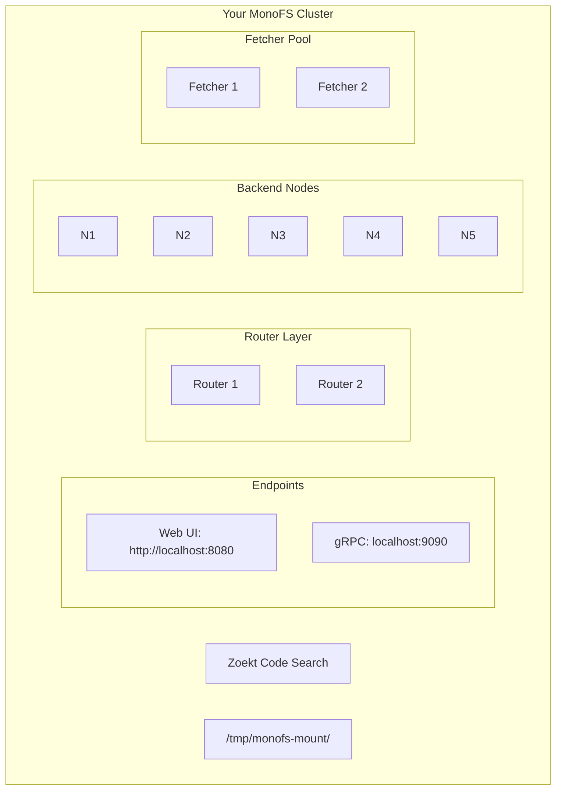

# MonoFS Quick Start Guide

Get MonoFS running in under 10 minutes. This guide covers the fastest path from zero to a mounted filesystem.

---

## Prerequisites

| Requirement | Minimum | Recommended |
|-------------|---------|-------------|
| Docker | 20.10+ | Latest |
| Docker Compose | 1.29+ | Latest |
| RAM | 4 GB | 8 GB |
| Disk Space | 10 GB | 50 GB |
| FUSE | Installed | - |

**Install FUSE (if not present):**

- Ubuntu/Debian: `sudo apt install fuse`
- RHEL/CentOS: `sudo yum install fuse`
- macOS: Install [macFUSE](https://osxfuse.github.io/)

---

## Option 1: Docker Quick Start (5 minutes)

### Step 1: Clone and Start the Cluster

```
git clone https://github.com/radryc/monofs.git
cd monofs
make deploy
```

Wait 30 seconds for services to initialize.

### Step 2: Verify Cluster Health

Open the Web UI at **http://localhost:8080**

You should see:
- 2 routers (1 primary, 1 backup)
- 5 backend nodes (all healthy)
- 2 fetchers (ready)

### Step 3: Ingest Your First Repository

```
docker exec -it monofs-router1-1 /app/monofs-admin ingest \
  --router=localhost:9090 \
  --source=https://github.com/golang/example.git \
  --ref=master
```

Watch progress in the Web UI at **http://localhost:8080/ingest**

### Step 4: Build the Client

```
make build-client
```

### Step 5: Mount the Filesystem

```
mkdir -p /tmp/monofs-mount

./bin/monofs-client \
  --mount=/tmp/monofs-mount \
  --router=localhost:9090
```

### Step 6: Browse Your Files

```
ls /tmp/monofs-mount/github.com/golang/example/
cat /tmp/monofs-mount/github.com/golang/example/README.md
```

**Congratulations!** You now have a distributed Git filesystem.

---

## Option 2: Local Development Setup (15 minutes)

For development without Docker.

### Step 1: Build All Binaries

```
make build
```

This creates binaries in the `bin/` directory.

### Step 2: Start a Single Node

Terminal 1 - Start the node:
```
./bin/monofs-server \
  --addr=:9001 \
  --node-id=node1 \
  --db-path=/tmp/monofs-node1
```

### Step 3: Start the Router

Terminal 2 - Start the router:
```
./bin/monofs-router \
  --port=9090 \
  --http-port=8080 \
  --nodes=node1=localhost:9001
```

### Step 4: Start a Fetcher

Terminal 3 - Start the fetcher:
```
./bin/monofs-fetcher \
  --port=9200 \
  --cache-dir=/tmp/fetcher-cache
```

### Step 5: Ingest a Repository

```
./bin/monofs-admin ingest \
  --router=localhost:9090 \
  --source=https://github.com/golang/example.git \
  --ref=master
```

### Step 6: Mount and Browse

```
mkdir -p /tmp/monofs-mount

./bin/monofs-client \
  --mount=/tmp/monofs-mount \
  --router=localhost:9090

# In another terminal:
ls /tmp/monofs-mount/
```

---

## What's Running

After startup, you have these services:



---

## Next Steps

### Ingest More Repositories

```
# Ingest from GitHub (auto-detects branch from URL)
./bin/monofs-admin ingest \
  --router=localhost:9090 \
  --source=https://github.com/kubernetes/kubernetes/tree/master

# Ingest a Go module
./bin/monofs-admin ingest \
  --router=localhost:9090 \
  --source=github.com/gin-gonic/gin@v1.9.0 \
  --ingestion-type=go \
  --fetch-type=gomod
```

### Enable Write Support

Mount with write capabilities:
```
./bin/monofs-client \
  --mount=/tmp/monofs-mount \
  --router=localhost:9090 \
  --writable
```

Manage your changes:
```
# Check status
./bin/monofs-session status

# Make edits to files in /tmp/monofs-mount/...

# Commit changes
./bin/monofs-session commit

# Or discard changes
./bin/monofs-session discard
```

### Search Code

Using the Web UI:
1. Go to **http://localhost:8080/search**
2. Enter your query
3. Filter by file pattern if needed

Using the CLI:
```
./bin/monofs-session search --query "func main" --max-results 20
```

### Monitor the Cluster

**Web UI pages:**
- Dashboard: http://localhost:8080/
- Cluster Status: http://localhost:8080/cluster
- Repositories: http://localhost:8080/repositories
- Search: http://localhost:8080/search
- Fetchers: http://localhost:8080/fetchers

**CLI commands:**
```
# Cluster status
./bin/monofs-admin status --router=localhost:9090

# Failover status
./bin/monofs-admin failover --router=localhost:9090

# Repository list
./bin/monofs-admin repos --router=localhost:8080

# Cluster statistics
./bin/monofs-admin stats --type=all
```

---

## Common Operations

### List Ingested Repositories

```
./bin/monofs-admin repos --router=localhost:8080
```

### Delete a Repository

```
./bin/monofs-admin delete --router=localhost:9090 --storage-id=<id>
```

Find the storage-id from the repos command or Web UI.

### Trigger Rebalancing

After adding/removing nodes:
```
./bin/monofs-admin rebalance --router=localhost:8080 --storage-id=<id>
```

### Test Failover

Stop a node and watch automatic recovery:
```
# Docker
docker stop monofs-node1-1

# Watch the Web UI - traffic redirects to backup node

# Restart node
docker start monofs-node1-1
```

### Maintenance Mode

Before planned downtime:
```
# Enter maintenance mode (disables failover)
./bin/monofs-admin drain --router=localhost:9090 --reason="Planned upgrade"

# Do your maintenance...

# Exit maintenance mode
./bin/monofs-admin undrain --router=localhost:9090
```

---

## Cleanup

### Unmount Filesystem

```
fusermount -u /tmp/monofs-mount
```

### Stop Docker Cluster

```
docker-compose down
```

### Remove All Data

```
docker-compose down -v
```

---

## Troubleshooting

### Client can't connect

1. Check that the router is running: `curl http://localhost:8080/health`
2. Verify the gRPC port is accessible: `nc -zv localhost 9090`
3. Look for errors in router logs: `docker logs monofs-router1-1`

### Mount fails with "permission denied"

Ensure FUSE is installed and your user has access:
```
# Check FUSE
ls -la /dev/fuse

# Add yourself to fuse group
sudo usermod -aG fuse $USER
# Log out and back in
```

### Files not appearing after ingest

1. Wait for ingestion to complete (check Web UI progress)
2. Verify repository was ingested: `./bin/monofs-admin repos`
3. Check for errors in node logs

### Slow file access

1. Enable local caching: `--cache=/tmp/monofs-cache`
2. Check fetcher status in Web UI
3. Ensure fetchers have network access to Git remotes

---

## Getting Help

- **Web UI**: http://localhost:8080 (when cluster is running)
- **Architecture**: See [ARCHITECTURE.md](ARCHITECTURE.md)
- **Deployment**: See [DEPLOYMENT.md](DEPLOYMENT.md)
- **Issues**: Open an issue on GitHub
