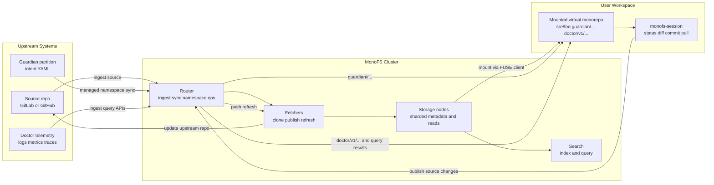

# MonoFS Architecture

## Overview

MonoFS is a distributed filesystem that projects many repositories and managed namespaces into a single mounted workspace.

At a high level, MonoFS has two jobs:

1. store and serve repository content through a clustered filesystem
2. project that content as a writable virtual monorepo with publish and refresh workflows

## System Model

MonoFS is composed of these major layers:

- **Router**: cluster coordination, repository ingestion, workspace sync orchestration, managed namespace operations, and client lifecycle handling
- **Storage nodes**: authoritative file metadata storage, directory indexes, repository registration, and shard ownership
- **Fetchers**: remote source retrieval, caching, bundle staging, publish execution, and refresh execution
- **Search**: repository and workspace indexing for query and navigation
- **FUSE client**: local mounted filesystem view, overlay session handling, and virtual-monorepo projection

## End-to-End Flow Diagram

The diagram below shows how an upstream source repository, Guardian-managed deployment intent, Doctor telemetry, and the mounted workspace fit together in one operational loop.

The key point is that the user works from one mounted workspace, but that workspace is fed by multiple platform surfaces through the MonoFS cluster.

## Data Model

MonoFS distinguishes between several repository identities:

- **Source**: the upstream location such as a Git URL, Go module path, or S3 bucket
- **Display path**: the user-visible filesystem path, either auto-generated from the source or explicitly assigned through `source_id`
- **Storage ID**: the internal stable identifier derived from the display path and used for sharding and lookup

This separation allows MonoFS to preserve upstream repository boundaries while presenting a workspace-oriented path model.

## Repository Ingestion Flow

Repository ingestion begins at the router.

1. A client submits an ingest request with `source`, optional `ref`, optional `source_id`, and backend configuration.
2. The router validates the request and determines the display path.
3. The router derives a storage ID from that display path.
4. Repository metadata is registered across storage nodes.
5. Files are ingested into the cluster, sharded by storage ID and path.
6. Directory indexes and repository lookup state are updated.

The important consequence is that the display path is not cosmetic. It becomes the visible identity used for workspace resolution.

## Filesystem Resolution

Path resolution uses the display path as the primary user-facing identity.

- Root and intermediate directories are synthesized from registered repository display paths.
- MonoFS resolves paths by longest-prefix matching against known display paths.
- Once the repository is identified, the remaining suffix is the repo-relative file path.

This is what makes the workspace feel monorepo-like even though the underlying sources remain separate.

## Sharding and Ownership

MonoFS distributes repository content across storage nodes.

- repositories are registered cluster-wide
- individual file ownership is assigned per shard
- metadata and data locality are coordinated through the router
- failover paths can redirect reads when the primary owner is unavailable

The router and node services also expose cluster health, node health, maintenance controls, and failover support.

## Writable Workspace Model

The mounted MonoFS workspace is not directly editing cluster state on every write.

Instead, writable sessions use a local overlay model:

- local creates, writes, deletes, and renames are tracked in a session layer
- pending changes can be inspected through `monofs-session`
- source-backed repository changes are published upstream through workspace sync flows
- dependency and blob-backed changes use separate push flows
- discarded sessions remove local overlay state without mutating upstream repositories

This design keeps the mounted workspace responsive and makes publish workflows explicit.

## Virtual Monorepo Projection

The virtual-monorepo mode is a workspace projection strategy.

It presents multiple repositories as one coherent root while still preserving repository metadata behind the scenes.

Key traits:

- a unified mounted root for many repositories
- synthetic workspace Git behavior for developer ergonomics
- selective hiding of system-oriented paths from the main developer surface
- support for writable overlays and session-based publish workflows

MonoFS therefore behaves like a monorepo from the user point of view while remaining multi-repo at the source-of-truth level.

## Guardian Integration

Guardian is integrated as a managed filesystem namespace.

Guardian-managed partition content appears under:

- `guardian/<partition>/...`

This namespace is not a normal ingested source repository. It is a managed operational surface backed by router-controlled partition operations and change tracking.

Effects of this model:

- partition intent becomes filesystem-visible
- partition updates can propagate through cluster APIs rather than Git-only workflows
- tools and users can inspect or watch operational desired state using filesystem semantics

MonoFS also reserves Guardian-related paths so unmanaged repository ingestion does not collide with managed namespaces.

## Doctor Integration

Doctor is integrated as a managed operational namespace and query surface.

Doctor-managed content appears under:

- `doctor/v1/...`

In addition to the filesystem namespace, MonoFS exposes Doctor log, metric, and trace ingest/query RPCs. This makes observability part of the platform surface rather than a disconnected side system.

Effects of this model:

- operational data is discoverable from the same platform boundary as source and config
- platform workflows can connect code, desired state, and telemetry more directly
- SRE workflows can move from source inspection to operational debugging without changing systems

## Workspace Sync

Workspace sync is the mechanism that turns a writable projected workspace into an upstream publishing system.

MonoFS supports:

- staging workspace bundles
- publishing workspace changes back to upstream repositories
- pushing source commits with preserved or squashed history semantics
- refreshing mounted repositories from upstream state
- tracking sync jobs and results through router APIs

The publish path requires known workspace repositories with source, branch, and base commit metadata. That is why MonoFS supports publishing changes to existing repositories but does not provision entirely new upstream repositories from scratch.

## Search and Discovery

Search services index ingested content so the mounted workspace remains usable at scale.

This matters because the value of a virtual monorepo is not only path unification. It is also the ability to discover code and operational content across repository boundaries.

## Operational Characteristics

MonoFS is intended to run as a distributed service, including on Kubernetes.

Typical deployment shape:

- one router deployment with persistent state for Guardian and workspace sync metadata
- multiple storage nodes with persistent volumes
- multiple fetchers with shared operational behavior and local cache state
- a search deployment
- FUSE-capable clients or device-plugin support where required

Persistence is important for:

- router Guardian state
- router workspace sync state
- storage node repository and file metadata
- fetcher caches

## Design Tradeoffs

MonoFS intentionally chooses:

- multi-repo upstream ownership over a single monolithic Git history
- explicit publish flows over implicit remote mutation
- managed namespaces for platform state instead of overloading normal repositories
- distributed storage and lookup over single-node simplicity

Those tradeoffs make sense for SRE Tool Hub because the goal is not only source hosting. The goal is a coherent workspace for code, control-plane data, and operations.
